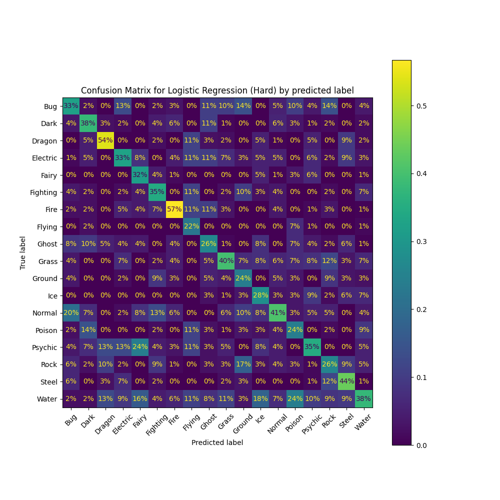

```{r setup, include=FALSE}
knitr::opts_chunk$set(echo = TRUE)
require(tidyverse)
require()
```

# Introduction

Pokémon is one of the most popular games worldwide where players catch, train and battle using monsters known as Pokemon. In particular, each Pokemon has one or two types such as "Water" and "fire" and their type may be more effective or suppressed by other types during battle. As a result, Pokemon players share great interest in exploiting types to win battles and are enthusiastic in Pokemon type prediction using other attributes. However, many of the previous attempts have failed as people have a limited number of observations due to game release periods or used limited attributes by choice. Thus, in order to make improvements on previous studies, we use classification techniques to re-examine the relationship between Pokemon types and their other attributes with an improved data set and a more diverse feature space. More importantly, we compare the performance between different models through nested CV and additionally attempt to predict Pokemon's secondary type if it exists.

# Dataset

## Data Scraping

Using [Pokédex Dataset](https://www.kaggle.com/datasets/mariotormo/complete-pokemon-dataset-updated-090420?select=pokedex_%28Update_04.21%29.csv) as an inspiration, we created our own scrapers with Python libraries `requests`, `beautifulsoup`, and `imageio` to scrape data from the Pokemon digital database [Pokémon DB](https://pokemondb.net/pokedex/all). The scraped attributes include `generation number`, `height`, `weight`, `combat` / `training` / `breeding` characteristics as well as the `weaknesses` (damage multipliers against other types) of each Pokemon. We also scraped images of each Pokemon and computed the imagery based data such as `size` and `RGB` value. Note that some features are eliminated as they posses challenges in model training or are irreverent in prediction. A detailed discussion on data processing can be found in Appendix.

## Feature introduction:

**Categorical features**:

| Column Name | Description                                                          |
|---------------------|---------------------------------------------------|
| status      | Whether the Pokémon is normal / legendary / sub-legendary / mythical |
| type_1      | The Primary Type of the Pokémon                                      |
| type_2      | The Secondary Type of the Pokémon if it exists                       |
| has_gender  | Whether the Pokémon has a gender                                     |

The types include: Bug, Dark, Dragon, Electric, Fairy, Fighting, Fire, Flying, Ghost, Grass, Ground, Ice, Normal, Poison, Psychic, Rock, Steel, Water \newpage

**Numerical features**:

| Feature Name          | Description                                                        |
|:----------------------|:------------------------------------------------|
| generation            | The chronological divisions of Pokémon, from 1st generation to 8th |
| type_number           | The number of types the Pokémon belong to, either 1 or 2           |
| height_m              | The height of the Pokémon in meters                                |
| weight_kg             | The weight of the Pokémon in kilograms                             |
| abilities_number      | The number of abilities possessed by the Pokémon                   |
| total_points          | Total number of base points                                        |
| hp                    | The base health points (hp) of the Pokémon                         |
| attack                | The base attack of the Pokémon                                     |
| defense               | The base defense of the Pokémon                                    |
| sp_attack             | The base special attack of the Pokémon                             |
| sp_defense            | The base special defense of the Pokémon                            |
| speed                 | The base speed of the Pokémon                                      |
| catch_rate            | Catch rate of the Pokémon                                          |
| base_friendship       | The base friendship of the Pokémon                                |
| base_experience       | The base experience of a wild Pokémon when caught                  |
| maximum_experience    | The experience needed for the Pokémon to reach the maximum level   |
| egg_type_number       | The number of egg groups the Pokémon egg belongs to                |
| proportion_male       | The proportion of Pokémon that is male. Set to 50% if genderless.  |
| egg_cycles            | The number of cycles required to hatch an egg of the Pokémon       |
| damage_from\_**Type** | The damage multiplier when damaged by the move from a **Type**     |

**Imagery features (numerical)**:

| Feature Name         | Description                                                                     |
|:---------------------|:-------------------------------------------------|
| size                 | The proportion of pixels occupied by the Pokémon's sprite                       |
| perimeter            | The number of pixels occupied by the sprite's boundary                          |
| perimeter_size_ratio | The ratio of the sprite's perimeter to its actual size                          |
| **Value**\_mean      | The mean of the **Value** pixel value over the entire sprite                    |
| **Value**\_sd        | The standard deviation of the **Value** pixel over the entire sprite            |
| vertical overflow    | The amount by which the sprite touches the boundaries of the image vertically   |
| horizontal overflow  | The amount by which the sprite touches the boundaries of the image horizontally |

**Value** = **Red**, **Green**, **Blue**, **Brightness**

# Previous Explorations

# Methods and Results

## Nested Cross-Validation

Acknowledging that the average `type_1` category has fewer than 60 Pokemon, we are working with a small amount of data. To make the most of this, we use stratified 5-fold nested cross validation so that every observation can take part in both the fitting and evaluation of models as well as introduce a more balanced as well as accurate representation of the type distribution. Using a fixed set of folds, we perform hyperparameter tuning on 4 folds at a time and use the final model to make predictions on the remaining fold. Through this process, we obtain one predicted type for each observation, and use this to produce an accuracy score and a confusion matrix.

## Hyperparameter Tuning

In each outer fold of nested cross validation, we perform another inner stratified 5-fold CV (cross validation) to select the best hyperparameters for the given model. However, for most models, the hyperparameter space is continuous and makes exhaustive search impossible. For example, regularized logistic regression admits a two-dimensional parameter space: $(0,{\infty})\times (0,{\infty})$.

In the early attempt, we tried grid search where we discretize the continuous search space and perform exhaustive search over the combination of hyperparameters in the search space. We then extracted the hyperparameters that optimizes the model in a stratified 5-fold CV and treat it as the optimal hyperparameters. For instance, we can reduce the search space of regularized logistic regression into $\{10^{-4}, 10^{-2}, 1, 10^2, 10^4\} \times \{10^{-4}, 10^{-2}, 1, 10^2, 10^4\}$ which contains $5^2 = 25$ points. However, there are two major drawbacks to this method. First, the hyperparameters in the discretized search space may be far from the true optimal parameters and second, the number of models needed to fit with a higher-dimensional hyperparameter spaces increases exponentially. This forces one to reduce the density of values in each dimension in order to keep the tuning process manageable.

To address the issue, we use Bayesian optimization (BayesOpt). Instead of a fixed set of values, we sample one point at a time from the parameter space, and evaluate the corresponding model's cross validation accuracy. We then treat the samples as data and fit a Gaussian process regression model to estimate the cross validation accuracy as a probabilistic function of the parameter space. In doing so, BayesOpt chooses the next sample according to a balance of exploration and exploitation. For exploration, BayesOpt targets points in regions with high uncertainty to gather information. For exploitation, BayesOpt targets points in regions with high expected accuracy to make incremental improvements. After some number of samples (50 in our case), BayesOpt reports the sample with the highest accuracy as the optimum. While it is not necessarily deterministic, it solves the problems faced by grid search. Namely, the optimum is not restricted to a predetermined set of points, and the algorithm adapts to any number of dimensions without forced exponential blowup. [@snoek2012practical]

## Logistic Regression

In Logistic Regression, we focused on multinomial logistic regression and used the Scikit-Learn package in Python. For multinomial logistic regression with $K \ge 2$ classes, we fit a single classifier with K outputs (one of them is 1), and take the softmax thereof. For regularization, ElasticNet encompasses both L1 and L2 penalties (and with a weak enough regularization term, no-penalty as well). We thus parameterize the search space of potential hyperparameters by the ratio of the L1 and L2 penalties, and the coefficient `C` representing the inverse of regularization strength. Specifically, we utilize Bayesian Optimization to sample over the entire continuous space with ranges of the ratio of the L1 and L2 penalties and `C` being $[0.0, 1.0]\times [1e-4, 1e4]$ .

After applying Bayesian Optimization and nested cross-validation with $k = 5$ folds, we observe that the ratio of the L1 and L2 penalties is constant at $1.0$ which indicates that lasso regularization or L1 penalty is chosen each time. The coefficient `C` fluctuates between the ranges of $[0, 5]$ indicating stronger regularization. Overall, we obtain a model accuracy of $96.302\%$.

We also examined the model performance without the features `type_2` and the `damage_from_{Type}` and used the same search space. We observe that the ratio of the L1 and L2 penalties fluctuate between the ranges of $[0.4, 1]$ and the coefficient `C` fluctuates between $[3.5, 10]$, indicating a stronger regularization. The model performance decreased significantly where the overall prediction accuracy decreased to $36.903%$. As a result, it would suggest that the `type_2` and `damage_from_{TYPE}` variables are very significant features in predicting Pokemon type.


## SVM (Support Vector Machine)

We trained SVM models with the Scikit-Learn package in Python. The hyperparameters we tested are the regularization parameter `C`, the `kernel` type, the `degree` of the polynomial if the kernel is polynomial, the kernel coefficient `gamma`, an independent term in the kernel function `coef0` (only significant for a polynomial/sigmoid kernel), and whether to use probability output. For tuning, we consider the linear, polynomial, and radial basis function kernels. The sigmoid kernel is never guaranteed to be positive semi-definite and therefore, avoided. Moreover, the linear kernel is just a special case of the polynomial kernel (with `degree` = 1, `gamma` = 1, `coef0` = 0), allowing us to specify it together with the polynomial kernel. Thus the hyperparameter search space is presented as `degree`, `C`, `gamma`, and `coef0` ranging between $[2, 5]\times[10^{-4}, 10^{4}]\times[10^{-3}, 10^{3}]\times[0.0, 1.0]$ for the polynomial kernel. For the radial basis function kernel, the search space is `C` and `gamma` ranging between $[10^{-4}, 10^{4}] \times [10^{-3}, 10^{3}]$ respectively.

We decided that for the decision_function_shape, it makes the most sense to use one-versus-rest (OVR) rather than one-versus-one (OVO). This is because there are $18$ classes in the data set, and OVR will significantly reduce the complexity of SVM by only having 18 models, whereas OVO will create $18 \times 17 = 306$ models which would increase the model complexity, training time, and the risk of overfitting.

After applying Bayesian Optimization and nested cross-validation with $k = 5$ folds, we observe that in general, the best kernel was radial basis function with the regularization parameter `C` fluctuating from $33$ to $10,000$ where `C` is inversely proportional to the strength of regularization and `gamma` was between $[0.002, 0.036]$. Overall, we obtain a model accuracy of $96.868\%$.

Next, we investigate the strength of the model without the features `type_2` and the `damage_from_{TYPE}` without changing the search space. We observed that in general the best kernel was still the radial basis function, with `C` and `gamma` ranging from $[18, 867]\times[0.15, 0.27]$ respectively. After removing these features, the overall model accuracy falls to $46.206%$.

## NN Neural Network

We use PyTorch and the scikit-learn package to train the Neural Network where we optimize the following hyperparameters: number of hidden layers, layer size, dropout rate, number of epochs and batch size.

The hyperparameter optimization for Neural Networks is challenging due to its time consuming training process and an enormous search space. In addition, we use randomly sampled batches to update weights and biases. As a result, the trained model contains a considerable amount of randomness and will impact our judgment on the actual performance of the model. To accommodate these issues, we use the greedy algorithm approach to optimize the hyperparameters. First, we optimize the number of hidden layers and nodes per layer, then, we adjust the dropout rate, number of epochs and batch size in search of the best model. Note for simplicity and computation feasibility, we assume a constant number of nodes for each hidden layer. To resolve the randomness during the training process, we simply compute the average CV losses over multiple iterations which, in theory, leads to a more robust estimate of the model performance. In the end, we will choose the set of hyperparameter sets that yields the lowest average CV losses and use them in the nested CV to examine the fitting power of Neural Networks.

The nested CV result of Neural Networks is very good. With the best setup, it is capable of reaching a prediction accuracy of 99% percent and in some test cases, the prediction power reached 100% accuracy.

The nested CV result of Neural Networks without type2 and damage_from variable is around 45%. Note that the outer CV result varies greatly from 40.8% to 49.8%. This suggests the performance of the Neural Network is not very stable and a potential cause of this instability is the batch randomness. However, further investigation is needed to draw conclusion.

## Random Forest

For random forest, we utilized the Scikit-Learn package in python. The search space of hyperparameters we tested includes the number of random features to select at each split `max_features` as well as the maximum depth of the tree `max_depth`. The maximum features depend on the number of features in the dataset. Meanwhile, the maximum theoretical depth is as much as the number of observations, but in practice we do not need even close to that much. We also limit it to the number of features to make the optimization problem easier.

After applying Bayesian Optimization and nested cross-validation with k = 5 folds, we observe that in general the `gini` index criterion was preferred while the `max_depth` and `max_features` fluctuate between [10, 38] and [35, 74] respectively. Overall, we obtain a model accuracy of 96.491%.

Next we also investigate the strength of the model without the features `type_2` and the `damage_from_{TYPE}`, with the same search space as before. We observe that the `gini` index criterion was still preferred while the `max_depth` and `max_features` fluctuate between [13, 37] and [3, 37] respectively. Overall, we obtain a model accuracy of 44.971% after removing these features.

# Interpretation of Results

# Discussion

# References {#sec:ref}

# Appendix

## Confusion Matrix on Test Data for Logistic Regression (Base) by predicted label

```{r, out.width = "500px", echo = F, fig.align='center'}

```

## Confusion Matrix on Test Data for Logistic Regression (Base) by true label

```{r, out.width = "500px", echo = F, fig.align='center'}

```

## Confusion Matrix on Test Data for Logistic Regression (Hard) by predicted label

```{r, out.width = "500px", echo = F, fig.align='center'}

```

## Confusion Matrix on Test Data for Logistic Regression (Hard) by true label

```{r, out.width = "500px", echo = F, fig.align='center'}

```

## Confusion Matrix on Test Data for Support Vector Machine (Base) by predicted label

```{r, out.width = "500px", echo = F, fig.align='center'}

```

## Confusion Matrix on Test Data for Support Vector Machine (Base) by true label

```{r, out.width = "500px", echo = F, fig.align='center'}

```

## Confusion Matrix on Test Data for Support Vector Machine (Hard) by predicted label

```{r, out.width = "500px", echo = F, fig.align='center'}

```

## Confusion Matrix on Test Data for Support Vector Machine (Hard) by true label

```{r, out.width = "500px", echo = F, fig.align='center'}

```

## Confusion Matrix on Test Data for Random Forest (Base) by predicted label

```{r, out.width = "500px", echo = F, fig.align='center'}

```

## Confusion Matrix on Test Data for Random Forest (Base) by true label

```{r, out.width = "500px", echo = F, fig.align='center'}
knitr::include_graphics("models/random_forest_machine_base/confusion_matrix_by_true.png")
```

## Confusion Matrix on Test Data for Random Forest (Hard) by predicted label

```{r, out.width = "500px", echo = F, fig.align='center'}
knitr::include_graphics("models/random_forest_machine_hard/confusion_matrix_by_pred.png")
```

## Confusion Matrix on Test Data for Random Forest (Hard) by true label

```{r, out.width = "500px", echo = F, fig.align='center'}
knitr::include_graphics("models/random_forest_machine_hard/confusion_matrix_by_true.png")
```