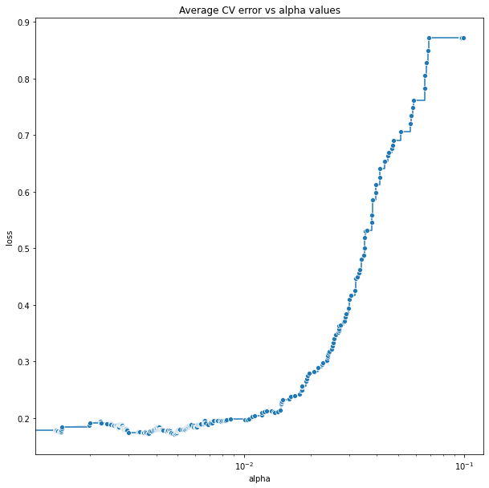
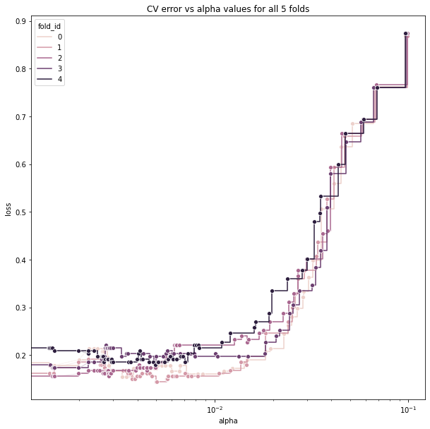
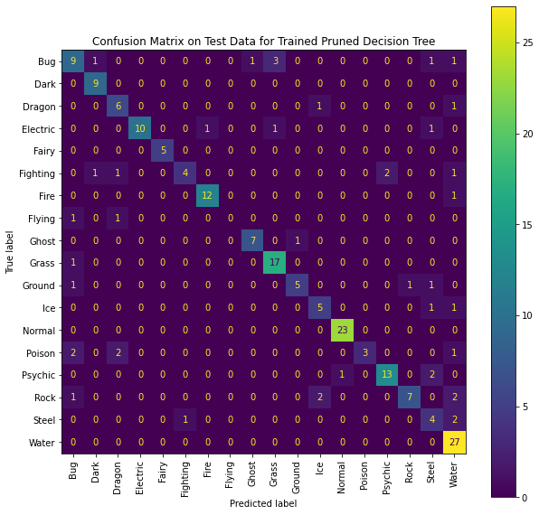

```{r setup, include = FALSE}
# Set of packages to use
require(kableExtra) # for tables
require(tidyverse) # loading it here prevents message display
require(nnet)
require(glmnet)
require(ggplot2)
require(leaps)
require(doParallel)
require(ggrepel)
require(tinytex)
require(scales)
require(reshape2)
library(Boruta)
library(gbm)
library(caret)
library(randomForest)
set.seed(441) # set the random seed for reproducible results

# Helper function reorder_cormat
reorder_cormat <- function(cormat){
  # Use correlation between variables as distance
  dd <- as.dist((1-cormat)/2)
  hc <- hclust(dd)
  cormat <-cormat[hc$order, hc$order]
}

# Helper function get_upper_tri
get_upper_tri <- function(cormat){
  cormat[lower.tri(cormat)]<- NA
  return(cormat)
}
```

# Research Problem

Pokémon is one of the most popular games where players catch and train monsters known as Pokémon, and use them to battle other trainers. Each Pokémon has one or two types, such as “Water” and “Fire”. Certain types have advantages against others in combat; for example, Water-type Pokémon deal increased damage to Fire-type Pokémon. Thus, type is an attribute of interest for Pokémon players. We are interested in using classification techniques to understand the relationship between a Pokémon’s type and its attributes.

# Dataset

We started with the [Pokédex Dataset](https://www.kaggle.com/datasets/mariotormo/complete-pokemon-dataset-updated-090420?select=pokedex_%28Update_04.21%29.csv), which contains one entry for each distinct Pokémon variant in generations 1-8 of the Pokémon games. It was primarily scraped from [Pokémon DB](https://pokemondb.net/pokedex/all), a website that lets users look up the attributes of any Pokémon. Attributes include generation number, height, combat statistics, training/breeding characteristics, and damage multipliers against each of the 18 types.
We created our own scrapers using the Python libraries `requests`, `beautifulsoup`, and `imageio` to fill in missing data and add further attributes about the sprites of each Pokémon. Further, we eliminate text features that have too many distinct values, or those which are too similar to what we are trying to predict. (Egg type is often exactly the same as type, so using it as a predictor would make the analysis uninteresting. After all transformations, our dataset contains 3 categorical features (including type), 1 binary feature, and 50 numerical features.

```{r,echo=F}
# Load and modify data
pokemon <- read.csv("C:/Users/Kkda/Desktop/Final Project/pokemon_train.csv",header=T)
pokemon[sapply(pokemon, is.character)] <- lapply(pokemon[sapply(pokemon, is.character)],as.factor)
# The numeric features
pokemon_numeric = pokemon[sapply(pokemon, is.numeric)]
```
# Previous Works

Single-label classification aims to predict the `type_1` feature of a Pokémon from its remaining features. All classification techniques covered in this course (STAT 441) are single-label.

Multi-label classification aims to predict all of a Pokémon’s types (both `type_1` and `type_2`) together. This is a more difficult task, but it is reasonable because the games do not distinguish between the first and second type – both are equally important.

There have been previous attempts to classify Pokémon type based on various sets of attributes. We can classify these attempts based on the features used, the type of classification performed, and the models used.

```{r child="tables/previous_works.md"}
```

We did not find any explorations that used combinations of data such as Pokedex and sprites together, so our work will be novel in that regard. We will first tackle the single-label classification problem, then attempt a new approach based on data duplication to automatically convert any single-label classifier into a multi-label one.

\newpage

# Exploratory Data Analysis
We briefly examine the average of numerical features of Pokémon in each type and we present a sample plot.
```{r,echo = F,fig.align='center',fig.dim=c(13,4)}
# Do the group means
pokemon_strength = pokemon_numeric[,c(4,5,19,22)] # Sample features
classes = levels(pokemon$type_1)
n_feature = ncol(pokemon_strength)
pokemon_class_means = matrix(ncol=n_feature,nrow=18)
for (i in 1:18){
  pokemon_temp = pokemon_strength[pokemon$type_1 == classes[i],]
  pokemon_class_means[i,] = apply(pokemon_temp,2,mean)
}
rownames(pokemon_class_means) = classes
colnames(pokemon_class_means) = colnames(pokemon_strength)

df <- data.frame(melt(pokemon_class_means, id = c("feature","type")))
colnames(df) = c("type","feature","mean")

ggplot(df, aes(x = feature, y=mean, group=type))+
  geom_col(aes(fill=type),position = position_dodge2(reverse=T))+
  facet_wrap(.~feature,ncol=4,scales="free")+
  theme(legend.position="right")+
  labs(title='Pokemon Feature Average Across Different Types')+
  theme(plot.title=element_text(hjust=0.5),
        axis.title=element_text(size=14))+
  theme(plot.title=element_text(size=22))+
  theme(axis.title = element_text(size = 15),
          strip.text = element_text(size = 15),
          strip.background = element_rect(fill = "white"),
          axis.text = element_text(size = 13),
          legend.text = element_text(size = 13))+
  theme(legend.text = element_text(size = 15))+
  labs(x = NULL, y = NULL)+
  scale_fill_manual(values=c("#A8B821", "#6F5848", "#7038F9","#F8D030", "#F7C9E3",
                             "#C03028", "#F07F2F", "#A890ED", "#705798","#78C84F",
                             "#E0C069", "#98D8D8", "#A9A878", "#A040A1",
                             "#F85788", "#B7A038", "#B8B8D0", "#6890F0"))
```
By inspection, Pokémon from a certain types will have a significantly higher/lower average in some of the features such as weight and egg cycles. However, this is not the case in general, an example of such would be number of abilities.The rest of the results are included in Appendix 2, 3, 4, and 5.

# Feature Importance

To solve this classification task, we first aim to determine the feature importance of the data using methods such as Random Forest (library randomForest) and the Boruta algorithm (library Boruta) in R. With the hope of reducing our feature space, we improve the model accuracy and convergence by eliminating redundant and irrelevant features. In addition, this can avoid overfitting with less complex models by having fewer weights in the models.

In a Random Forest model, variable importance can be measured using the permutation-based difference in out of bag error (or mean decrease in accuracy). The Boruta algorithm uses this to perform feature selection. For each feature in the original dataset, we shuffle its observed values to produce a permuted “shadow feature”. Fitting a Random Forest on both the features and their shadows, features that are chosen more often than any other shadow feature are selected. The algorithm repeats this many times, measuring the importance of each feature by how frequently it is selected. The highest-frequency features are accepted, the lowest-frequency features are rejected, and everything in between is considered tentative. Refer to appendix 6 and 7 for the respective plots of feature importance.

# Overview of Classification Method

After performing feature importance analysis, we will be able to fit different models on the dataset. The methods that can be used in the scope of this class are Logistic Regression, Decision Tree, Random Forest, Neural Networks, and Support Vector Machine. We will be using both R and Python as primary coding languages. For Logistic Regression, we will implement it with R. For all other models, we will implement them in Python with combinations of Sci-kit Learn, TensorFlow, and PyTorch.
Given the large number of features and classes in the dataset, we believe Decision Tree will be able to provide a reasonable baseline which all other models, such as tree-based ensemble methods and neural networks can be contrasted against.

To compare the difference in model performance, we will apply the nested cross-validation (CV) approach to the different models. The dataset will be split into 10 stratified sets, where we want to have an even split in terms of y-value to guarantee the model is trained and evaluated on all existing classes with the original data distribution, and we take out 1 set in the outer CV each time. Then, we will do the inner CV with the other 9 sets by splitting them into 10 stratified sets. The error for the inner CV will allow us to select the best tuning parameters, and use the tuning parameters to find the best model parameter in the outer CV. The different models with the optimal tuning and model parameters will be compared by using their average CV error across all outer folds as an estimated expected error across the entire dataset.

# Prelimary Results

We opted to have a decision tree as our baseline. Using a 5-fold cross-validation on the training set, we were able to plot the error vs alpha values for each fold and the average CV error vs alpha values, illustrated in appendix 8 and below respectively.
```{r,out.width = "300px", echo = F, fig.align='center'}

```
The optimal alpha is 0.004813. We then used this optimal alpha to generate an optimal decision tree, which has 36 leaf nodes. This tree is then evaluated on the test set, which achieved a 79.4% prediction accuracy. A confusion matrix is also plotted in Appendix 9. We can see that most of the predictions are really good. This decision tree model does not do well with Bug-type Pokémon and often classifies them as other classes. The model also predicts some Pokémon as Water Type and Steel Type while they are actually not. These predictions may be improved by other models that we plan to train.

\newpage
# Appendix

## Appendix 1: Data set

The [Pokédex Dataset](https://www.kaggle.com/datasets/mariotormo/complete-pokemon-dataset-updated-090420?select=pokedex_%28Update_04.21%29.csv) contains 13 text attributes (including Pokémon type) and 37 continuous attributes. Some text features are name of the Pokémon and do not contribute in making predictions, hence we remove them from our analysis. Other text attributes include the type of the Pokémon and its eggs. Meanwhile, the majority of continuous attributes are made up by the Pokémon’s combat statistics such as attack and defense, as well as specific statistics about combat interactions. The `damage_from_X` attributes indicates the weakness of the Pokémon: the damage received by a Pokémon from type `X` is multiplied by the `damage_from_X` factor. The combination of all 18 `damage_from_X` attributes encodes the Pokémon’s type-based advantages and disadvantages in combat.

Each Pokémon sprite is a 56x42 image, from which we derive an additional 13 features.

- `sprite_size`: the proportion of pixels occupied by the sprite

- `sprite_perimeter`: the number of pixels occupied by the sprite’s boundary

- `sprite_{red/green/blue/brightness}_mean`: the mean of that pixel value over the entire sprite

- `sprite_{red/green/blue/brightness}_sd`: the (population) standard deviation of that pixel over the entire sprite

- `sprite_overflow_{vertical/horizontal}`: the amount by which the sprite touches the boundaries of the image

We also noticed that a Pokémon’s egg’s type is usually the same as the type of the Pokémon itself. Using that feature would make the classification task too easy. Furthermore, using egg type is against the spirit of the classification task because that information is more obscure than type itself. After removing egg type and performing some other transformations, we arrive at a final dataset containing 3 categorical features (including type), 1 binary feature, and 50 numerical features.

## Appendix 2: Numerical Feature Average Plot 1:
```{r,echo = F,fig.align='center',fig.dim=c(40,40)}
# Do the group means
pokemon_strength = pokemon_numeric[,1:15] # Sample features
classes = levels(pokemon$type_1)
n_feature = ncol(pokemon_strength)
pokemon_class_means = matrix(ncol=n_feature,nrow=18)
for (i in 1:18){
  pokemon_temp = pokemon_strength[pokemon$type_1 == classes[i],]
  pokemon_class_means[i,] = apply(pokemon_temp,2,mean)
}
rownames(pokemon_class_means) = classes
colnames(pokemon_class_means) = colnames(pokemon_strength)

df <- data.frame(melt(pokemon_class_means, id = c("feature","type")))
colnames(df) = c("type","feature","mean")

ggplot(df, aes(x = feature, y=mean, group=type))+
  geom_col(aes(fill=type),position = position_dodge2(reverse=T))+
  facet_wrap(.~feature,ncol=3,scales="free")+
  theme(legend.position="right")+
  labs(title='Pokemon Feature Average Across Different Types')+
  theme(plot.title=element_text(hjust=0.5))+
  theme(plot.title=element_text(size=35))+
  labs(x = NULL, y = NULL)+
  scale_fill_manual(values=c("#A8B821", "#6F5848", "#7038F9","#F8D030", "#F7C9E3",
                             "#C03028", "#F07F2F", "#A890ED", "#705798","#78C84F",
                             "#E0C069", "#98D8D8", "#A9A878", "#A040A1",
                             "#F85788", "#B7A038", "#B8B8D0", "#6890F0"))
```
\newpage

## Appendix 3: Numerical Feature Average Plot 2:
```{r,echo = F,fig.align='center',fig.dim=c(40,40)}
# Do the group means
pokemon_strength = pokemon_numeric[,16:30] # Sample features
classes = levels(pokemon$type_1)
n_feature = ncol(pokemon_strength)
pokemon_class_means = matrix(ncol=n_feature,nrow=18)
for (i in 1:18){
  pokemon_temp = pokemon_strength[pokemon$type_1 == classes[i],]
  pokemon_class_means[i,] = apply(pokemon_temp,2,mean)
}
rownames(pokemon_class_means) = classes
colnames(pokemon_class_means) = colnames(pokemon_strength)

df <- data.frame(melt(pokemon_class_means, id = c("feature","type")))
colnames(df) = c("type","feature","mean")

ggplot(df, aes(x = feature, y=mean, group=type))+
  geom_col(aes(fill=type),position = position_dodge2(reverse=T))+
  facet_wrap(.~feature,ncol=3,scales="free")+
  theme(legend.position="right")+
  labs(title='Pokemon Feature Average Across Different Types')+
  theme(plot.title=element_text(hjust=0.5))+
  theme(plot.title=element_text(size=35))+
  labs(x = NULL, y = NULL)+
  scale_fill_manual(values=c("#A8B821", "#6F5848", "#7038F9","#F8D030", "#F7C9E3",
                             "#C03028", "#F07F2F", "#A890ED", "#705798","#78C84F",
                             "#E0C069", "#98D8D8", "#A9A878", "#A040A1",
                             "#F85788", "#B7A038", "#B8B8D0", "#6890F0"))
```
\newpage

## Appendix 4: Numerical Feature Average Plot 3:
```{r,echo = F,fig.align='center',fig.dim=c(40,40)}
# Do the group means
pokemon_strength = pokemon_numeric[,31:50] # Sample features
classes = levels(pokemon$type_1)
n_feature = ncol(pokemon_strength)
pokemon_class_means = matrix(ncol=n_feature,nrow=18)
for (i in 1:18){
  pokemon_temp = pokemon_strength[pokemon$type_1 == classes[i],]
  pokemon_class_means[i,] = apply(pokemon_temp,2,mean)
}
rownames(pokemon_class_means) = classes
colnames(pokemon_class_means) = colnames(pokemon_strength)

df <- data.frame(melt(pokemon_class_means, id = c("feature","type")))
colnames(df) = c("type","feature","mean")

ggplot(df, aes(x = feature, y=mean, group=type))+
  geom_col(aes(fill=type),position = position_dodge2(reverse=T))+
  facet_wrap(.~feature,ncol=3,scales="free")+
  theme(legend.position="right")+
  labs(title='Pokemon Feature Average Across Different Types')+
  theme(plot.title=element_text(hjust=0.5))+
  theme(plot.title=element_text(size=35))+
  labs(x = NULL, y = NULL)+
  scale_fill_manual(values=c("#A8B821", "#6F5848", "#7038F9","#F8D030", "#F7C9E3",
                             "#C03028", "#F07F2F", "#A890ED", "#705798","#78C84F",
                             "#E0C069", "#98D8D8", "#A9A878", "#A040A1",
                             "#F85788", "#B7A038", "#B8B8D0", "#6890F0"))
```
\newpage

## Appendix 5: Correlation heat map between numeric variables
```{r,fig.align="center",fig.dim=c(14,14),echo=F}
# Correlation heat map between numeric variables
pokemon_numeric = pokemon[sapply(pokemon, is.numeric)]
pokemon_info = pokemon_numeric
# Calculate correlation matrix
cormat <- round(cor(pokemon_info),3)
# Reorder correlation matrix
cormat <- reorder_cormat(cormat)
# Obtain the upper triangular correlation matrix
upper_tri <- get_upper_tri(cormat)
# Reshape the correlation matrix
melted_cormat <- melt(upper_tri, na.rm = TRUE)
# Create heat map
ggheatmap <- ggplot(melted_cormat, aes(Var2, Var1, fill = value))+
  geom_tile(color = "#ECF0F1")+
  scale_fill_gradient2(low = "#1F6CFA", high = "#FB4941", mid = "#FFFFFF",
                       midpoint = 0, limit = c(-1,1), space = "Lab",
                       name="Pearson\nCorrelation") +
  theme_minimal()+ # minimal theme
  theme(axis.text.x = element_text(angle = 45, vjust = 1,
                                   size = 12, hjust = 1))+
  coord_fixed()+
  labs(title="Correlation Heat Map")+
  theme(plot.title=element_text(hjust=0.5))
# Print the heatmap
print(ggheatmap)
```
\newpage

## Appendix 6: Boruta Algorithm Feature Importance Plot
```{r,fig.align="center",fig.dim=c(17,22),echo=F}
# Random Forest for Variable Importance
# Removing 'type_2'
pokemon_rf <- randomForest(type_1 ~., data = pokemon[,-5], importance = TRUE)

# Boruta algorithm
b1 <- Boruta(pokemon[,-c(4,5)], pokemon[,4])

b1_imp <- data.frame(colMeans(b1$ImpHistory))
colnames(b1_imp) <- "Mean"
b1_imp[b1_imp$Mean == '-Inf',] <- -1

b1_imp <- b1_imp %>%
  mutate(feature = row.names(.)) %>%
  filter(!grepl("shadow", feature))

b1_imp$decision <- b1$finalDecision

ggplot(b1_imp, aes(x = reorder(feature, Mean),
                   y = Mean,
                   fill = decision)) +
  geom_bar(stat = 'identity') +
  coord_flip() +
  labs(x = "Feature",
       y = "Importance",
       title = "Importance of Variables by the Boruta Algorithm")+
  theme(plot.title=element_text(size=30))+
  theme(plot.title=element_text(hjust=0.5),
          axis.title=element_text(size=15))+
  theme(axis.title.y = element_text(size = 16))+
  theme(axis.text.y = element_text(size=15.5))+
  labs(x= NULL)+
  theme(axis.title.x = element_text(size = 30))+
  theme(legend.text = element_text(size = 25))
```
\newpage

## Appendix 7: Random Forest Feature Importance Plot
```{r,fig.align="center",fig.dim=c(17,22),echo=F}
# Random Forest Feature Importance Plot
feat_imp <- data.frame(importance(pokemon_rf)) %>%
  mutate(feature = row.names(.))

ggplot(feat_imp, aes(x = reorder(feature, MeanDecreaseAccuracy),
                     y = MeanDecreaseAccuracy)) +
    geom_bar(stat='identity', fill = "#1F6CFA") +
    coord_flip() +
    labs(x = "Feature",
         y = "Relative Importance",
         title = "Feature Importance From Random Forest")+
    theme(plot.title=element_text(size=30))+
    theme(plot.title=element_text(hjust=0.5),
          axis.title=element_text(size=15))+
    theme(axis.title.y = element_text(size = 16))+
    theme(axis.text.y = element_text(size=15.5))+
    labs(x=NULL)+
    theme(axis.title.x = element_text(size = 30))
```
\newpage

## Appendix 8: CV Error vs Alpha 5 fold
```{r, out.width = "500px", echo = F, fig.align='center'}

```
\newpage

## Appendix 9: Confusion Matrix
```{r, out.width = "500px", echo = F, fig.align='center'}

```
\newpage

# R Code

```{r, eval = FALSE}
# Set of packages to use
require(kableExtra) # for tables
require(tidyverse) # loading it here prevents message display
require(nnet)
require(glmnet)
require(ggplot2)
require(leaps)
require(doParallel)
require(ggrepel)
require(tinytex)
require(scales)
require(reshape2)
library(Boruta)
library(gbm)
library(caret)
library(randomForest)
set.seed(441) # set the random seed for reproducible results

# Helper function reorder_cormat
reorder_cormat <- function(cormat){
  # Use correlation between variables as distance
  dd <- as.dist((1-cormat)/2)
  hc <- hclust(dd)
  cormat <-cormat[hc$order, hc$order]
}

# Helper function get_upper_tri
get_upper_tri <- function(cormat){
  cormat[lower.tri(cormat)]<- NA
  return(cormat)
}

# Load and modify data
pokemon <- read.csv("C:/Users/Kkda/Desktop/Final Project/pokemon_train.csv",header=T)
pokemon[sapply(pokemon, is.character)] <- lapply(pokemon[sapply(pokemon, is.character)],as.factor)
# The numeric features
pokemon_numeric = pokemon[sapply(pokemon, is.numeric)]
# Do the group means
pokemon_strength = pokemon_numeric[,c(4,5,19,22)] # Sample features
classes = levels(pokemon$type_1)
n_feature = ncol(pokemon_strength)
pokemon_class_means = matrix(ncol=n_feature,nrow=18)
for (i in 1:18){
  pokemon_temp = pokemon_strength[pokemon$type_1 == classes[i],]
  pokemon_class_means[i,] = apply(pokemon_temp,2,mean)
}
rownames(pokemon_class_means) = classes
colnames(pokemon_class_means) = colnames(pokemon_strength)

df <- data.frame(melt(pokemon_class_means, id = c("feature","type")))
colnames(df) = c("type","feature","mean")

ggplot(df, aes(x = feature, y=mean, group=type))+
  geom_col(aes(fill=type),position = position_dodge2(reverse=T))+
  facet_wrap(.~feature,ncol=4,scales="free")+
  theme(legend.position="right")+
  labs(title='Pokemon Feature Average Across Different Types')+
  theme(plot.title=element_text(hjust=0.5),
        axis.title=element_text(size=14))+
  theme(plot.title=element_text(size=22))+
  theme(axis.title = element_text(size = 15),
          strip.text = element_text(size = 15),
          strip.background = element_rect(fill = "white"),
          axis.text = element_text(size = 13),
          legend.text = element_text(size = 13))+
  theme(legend.text = element_text(size = 15))+
  labs(x = NULL, y = NULL)+
  scale_fill_manual(values=c("#A8B821", "#6F5848", "#7038F9","#F8D030", "#F7C9E3",
                             "#C03028", "#F07F2F", "#A890ED", "#705798","#78C84F",
                             "#E0C069", "#98D8D8", "#A9A878", "#A040A1",
                             "#F85788", "#B7A038", "#B8B8D0", "#6890F0"))

# Correlation heat map between numeric variables
pokemon_numeric = pokemon[sapply(pokemon, is.numeric)]
pokemon_info = pokemon_numeric
# Calculate correlation matrix
cormat <- round(cor(pokemon_info),3)
# Reorder correlation matrix
cormat <- reorder_cormat(cormat)
# Obtain the upper triangular correlation matrix
upper_tri <- get_upper_tri(cormat)
# Reshape the correlation matrix
melted_cormat <- melt(upper_tri, na.rm = TRUE)
# Create heat map
ggheatmap <- ggplot(melted_cormat, aes(Var2, Var1, fill = value))+
  geom_tile(color = "#ECF0F1")+
  scale_fill_gradient2(low = "#1F6CFA", high = "#FB4941", mid = "#FFFFFF",
                       midpoint = 0, limit = c(-1,1), space = "Lab",
                       name="Pearson\nCorrelation") +
  theme_minimal()+ # minimal theme
  theme(axis.text.x = element_text(angle = 45, vjust = 1,
                                   size = 12, hjust = 1))+
  coord_fixed()+
  labs(title="Correlation Heat Map")+
  theme(plot.title=element_text(hjust=0.5))
# Print the heatmap
print(ggheatmap)

# Random Forest for Variable Importance
# Removing 'type_2'
pokemon_rf <- randomForest(type_1 ~., data = pokemon[,-5], importance = TRUE)

# Boruta algorithm
b1 <- Boruta(pokemon[,-c(4,5)], pokemon[,4])

b1_imp <- data.frame(colMeans(b1$ImpHistory))
colnames(b1_imp) <- "Mean"
b1_imp[b1_imp$Mean == '-Inf',] <- -1

b1_imp <- b1_imp %>%
  mutate(feature = row.names(.)) %>%
  filter(!grepl("shadow", feature))

b1_imp$decision <- b1$finalDecision

ggplot(b1_imp, aes(x = reorder(feature, Mean),
                   y = Mean,
                   fill = decision)) +
  geom_bar(stat = 'identity') +
  coord_flip() +
  labs(x = "Feature",
       y = "Importance",
       title = "Importance of Variables by the Boruta Algorithm")+
  theme(plot.title=element_text(size=30))+
  theme(plot.title=element_text(hjust=0.5),
          axis.title=element_text(size=15))+
  theme(axis.title.y = element_text(size = 16))+
  theme(axis.text.y = element_text(size=15.5))+
  labs(x= NULL)+
  theme(axis.title.x = element_text(size = 30))+
  theme(legend.text = element_text(size = 25))

# Random Forest Feature Importance Plot
feat_imp <- data.frame(importance(pokemon_rf)) %>%
  mutate(feature = row.names(.))

ggplot(feat_imp, aes(x = reorder(feature, MeanDecreaseAccuracy),
                     y = MeanDecreaseAccuracy)) +
    geom_bar(stat='identity', fill = "#1F6CFA") +
    coord_flip() +
    labs(x = "Feature",
         y = "Relative Importance",
         title = "Feature Importance From Random Forest")+
    theme(plot.title=element_text(size=30))+
    theme(plot.title=element_text(hjust=0.5),
          axis.title=element_text(size=15))+
    theme(axis.title.y = element_text(size = 16))+
    theme(axis.text.y = element_text(size=15.5))+
    labs(x=NULL)+
    theme(axis.title.x = element_text(size = 30))
```

```{r child="converted_ipynb/build_decision_tree.rmd"}
```

```{r child="converted_ipynb/1_scrape_missing_values.Rmd"}
```

```{r child="converted_ipynb/2_generate_features.Rmd"}
```

```{r child="converted_ipynb/3_split_data.Rmd"}
```

## Scraper Code

The following files define functions used to scrape Pokédex entries and sprites from the Pokémon DB.

## `util/dict.py`

```py
from typing import Generic, TypeVar
from difflib import get_close_matches


K = TypeVar('K')
V = TypeVar('V')


class FuzzyDict(Generic[V]):
    def __init__(self, items: dict[str, V]):
        assert len(items) > 0

        self._items = items
        self._n_items = len(self._items)
        self._keys = list(self._items.keys())

    def get(self, key: str) -> V:
        if (key in self._items):
            return self._items[key]
        # hack to get around Darmanitan mapping to Galarian
        elif key.startswith("Darmanitan "):
            return self.get(key[len("Darmanitan "):])
        closest, = get_close_matches(
            word=key,
            possibilities=self._keys,
            n=1,
            cutoff=0.0,
        )
        print(f"'{key}' not found, falling back to '{closest}'")
        return self._items[closest]

    def __repr__(self) -> str:
        return repr(self._items)


def safe_update(d: dict[K, V], key: K, value: V) -> None:
    if key in d:
        assert d[key] == value, f'Key mismatch: expected {value} at {key} but got {d[key]}'
    else:
        d[key] = value
```

## `util/soup.py`

```py
from os import path

from bs4 import BeautifulSoup
import requests


def load_soup(load_path: str) -> BeautifulSoup:
    with open(load_path, "r") as f:
        soup = BeautifulSoup(f.read(), 'html.parser')
    return soup


def save_soup(soup: BeautifulSoup, save_path: str) -> None:
    with open(save_path, "w") as f:
        f.write(str(soup))


def fetch_soup(url: str, cache_path: str) -> BeautifulSoup:
    if path.exists(cache_path):
        # print(f"Resource {url} found in cache at {cache_path}")
        soup = load_soup(cache_path)
    else:
        # print(f"Resource {url} not in cache, fetching...")
        req = requests.get(url)
        soup = BeautifulSoup(req.text, 'html.parser')
        # print(f"Saving resource {url} to cache at {cache_path}")
        save_soup(soup, cache_path)
    return soup


def parse_str(soup: BeautifulSoup) -> str:
    return soup.text.strip()


def parse_int(soup: BeautifulSoup) -> int:
    return int(parse_str(soup).split()[0])


def parse_percent(soup: BeautifulSoup) -> float:
    raw = parse_str(soup).split()[0]
    assert raw.endswith("%")
    return float(raw[:-1])
```

## `util/sprite.py`

```py
from functools import cached_property
from os import path

import imageio.v3 as iio
import requests
import numpy as np


class Sprite:
    def __init__(self, img: np.ndarray):
        height, width, channels = img.shape
        assert height == 42
        assert width in (52, 56)
        assert channels == 4

        self.img = img / 255.  # normalize the image
        self.height = height
        self.width = width

    @staticmethod
    def fetch(url: str, cache_path: str) -> "Sprite":
        if not path.exists(cache_path):
            req = requests.get(url)
            with open(cache_path, "wb") as f:
                f.write(req.content)
        img = iio.imread(cache_path, extension=".png", mode="RGBA")
        return Sprite(img)

    @property
    def red(self) -> np.ndarray:
        return self.img[:, :, 0]

    @property
    def green(self) -> np.ndarray:
        return self.img[:, :, 1]

    @property
    def blue(self) -> np.ndarray:
        return self.img[:, :, 2]

    @cached_property
    def brightness(self) -> np.ndarray:
        return (self.red + self.green + self.blue) / 3.

    @property
    def alpha(self) -> np.ndarray:
        return self.img[:, :, 3]

    @cached_property
    def perimeter(self) -> np.ndarray:
        is_perimeter = np.zeros_like(self.alpha)
        for i in range(self.height):
            for j in range(self.width):
                if self.alpha[i, j] > 0.:
                    if (
                        i == 0 or i == self.height - 1
                        or j == 0 or j == self.width - 1
                    ):
                        is_perimeter[i, j] = 1.
                    elif (
                        self.alpha[i-1, j] == 0.
                        or self.alpha[i+1, j] == 0.
                        or self.alpha[i, j-1] == 0.
                        or self.alpha[i, j+1] == 0.
                    ):
                        is_perimeter[i, j] = 1.
        return is_perimeter
```


## `scrape.py`

```py
from functools import cached_property
from math import sqrt
from os import path, mkdir

from bs4 import BeautifulSoup

from .util.dict import FuzzyDict, safe_update
from .util.soup import (
    fetch_soup,
    load_soup,
    parse_int,
    parse_percent,
    parse_str,
    save_soup
)
from .util.sprite import Sprite


POKEDEX_URL = "https://pokemondb.net/pokedex/"
ALL_URL = path.join(POKEDEX_URL, "all")

SCRIPT_PATH = path.realpath(__file__)

BASE_CACHE_DIR = path.join(path.dirname(SCRIPT_PATH), ".cache")
if not path.exists(BASE_CACHE_DIR):
    mkdir(BASE_CACHE_DIR)

POKEMON_CACHE_DIR = path.join(BASE_CACHE_DIR, "pokemon")
if not path.exists(POKEMON_CACHE_DIR):
    mkdir(POKEMON_CACHE_DIR)

VARIANT_CACHE_DIR = path.join(BASE_CACHE_DIR, "variant")
if not path.exists(VARIANT_CACHE_DIR):
    mkdir(VARIANT_CACHE_DIR)

SPRITE_CACHE_DIR = path.join(BASE_CACHE_DIR, "sprite")
if not path.exists(SPRITE_CACHE_DIR):
    mkdir(SPRITE_CACHE_DIR)

REGIONAL_PREFIXES = ["Galarian", "Alolan"]


def get_full_name(base_name: str, variant_name: str) -> str:
    if base_name in variant_name:
        return variant_name
    for prefix in REGIONAL_PREFIXES:
        if variant_name.startswith(prefix):
            variant_name_rest = variant_name[len(prefix):].strip()
            return f'{prefix} {base_name} {variant_name_rest}'
    return f'{base_name} {variant_name}'


def name_to_dex_path() -> FuzzyDict[str]:
    page = fetch_soup(
        url=path.join(POKEDEX_URL, "all"),
        cache_path=path.join(BASE_CACHE_DIR, "all.html"),
    )
    cells = page.find_all("td", "cell-name")

    mapping = {}
    for cell in cells:
        name_a = cell.find("a", "ent-name")
        pokemon = path.basename(name_a["href"])

        base_name = parse_str(name_a)
        safe_update(mapping, key=base_name, value=pokemon)

        variant_small = cell.find("small", "text-muted")
        if variant_small is None:
            continue

        variant_name = parse_str(variant_small)
        safe_update(
            mapping,
            key=get_full_name(base_name, variant_name),
            value=pokemon,
        )

    return FuzzyDict(mapping)


def name_to_sprite_url() -> FuzzyDict[str]:
    page = fetch_soup(
        url=path.join(POKEDEX_URL, "all"),
        cache_path=path.join(BASE_CACHE_DIR, "all.html"),
    )
    cells = page.find_all("td", "cell-name")

    mapping = {}
    for cell in cells:
        name_a = cell.find("a", "ent-name")
        base_name = parse_str(name_a)

        row = cell.find_parent("tr")
        sprite = row.find("img", "img-fixed icon-pkmn")
        sprite_url = sprite["src"]

        variant_small = cell.find("small", "text-muted")

        # hack to get around Burmy mapping to Buneary
        if base_name == "Burmy" and "Burmy" not in mapping:
            safe_update(mapping, key=base_name, value=sprite_url)

        if variant_small is None:
            safe_update(mapping, key=base_name, value=sprite_url)
        else:
            variant_name = parse_str(variant_small)
            safe_update(
                mapping,
                key=get_full_name(base_name, variant_name),
                value=sprite_url,
            )

    return FuzzyDict(mapping)


def fetch_pokemon_soup(dex_path: str) -> BeautifulSoup:
    return fetch_soup(
        url=path.join(POKEDEX_URL, dex_path),
        cache_path=path.join(POKEMON_CACHE_DIR, f"{dex_path}.html"),
    )


def fetch_variant_soup(dex_path: str, variant_name: str) -> BeautifulSoup:
    cache_path = path.join(VARIANT_CACHE_DIR, f"{variant_name}.html")
    if path.exists(cache_path):
        # print(f"Variant {variant} found in cache at {cache_path}")
        variant_soup = load_soup(cache_path)
    else:
        # print(f"Variant {variant} not in cache, fetching...")
        pokemon_soup = fetch_pokemon_soup(dex_path)

        tabs = pokemon_soup.find("div", "sv-tabs-tab-list").find_all("a")
        variant_to_id = FuzzyDict({
            parse_str(tab): tab["href"].lstrip("#")
            for tab in tabs
        })
        closest_id = variant_to_id.get(variant_name)
        variant_soup = pokemon_soup.find("div", id=closest_id)
        # print(f"Saving variant {variant} to cache at {cache_path}")
        save_soup(variant_soup, cache_path)
    return variant_soup


def fetch_variant_sprite(url: str, variant_name: str) -> Sprite:
    cache_path = path.join(SPRITE_CACHE_DIR, f"{variant_name}.png")
    return Sprite.fetch(url, cache_path)


class Variant:
    _NAME_TO_DEX_PATH = name_to_dex_path()
    _NAME_TO_SPRITE_URL = name_to_sprite_url()
    PROPERTIES = [
        "base_experience",
        "base_friendship",
        "catch_rate",
        "egg_cycles",
        "growth_rate",
        "percentage_male",
        "sprite_size",
        "sprite_perimeter",
        "sprite_perimeter_to_size_ratio",
        "sprite_red_mean",
        "sprite_green_mean",
        "sprite_blue_mean",
        "sprite_brightness_mean",
        "sprite_red_sd",
        "sprite_green_sd",
        "sprite_blue_sd",
        "sprite_brightness_sd",
        "sprite_overflow_vertical",
        "sprite_overflow_horizontal",
    ]

    def __init__(self, name: str, soup: BeautifulSoup, sprite: Sprite):
        self.name = name
        self._soup = soup
        self._sprite = sprite

    @classmethod
    def fetch(cls, variant_name: str) -> "Variant":
        dex_path = cls._NAME_TO_DEX_PATH.get(variant_name)
        sprite_url = cls._NAME_TO_SPRITE_URL.get(variant_name)
        soup = fetch_variant_soup(
            dex_path=dex_path,
            variant_name=variant_name,
        )
        sprite = fetch_variant_sprite(
            url=sprite_url,
            variant_name=variant_name,
        )
        return Variant(name=variant_name, soup=soup, sprite=sprite)

    @cached_property
    def catch_rate(self) -> int:
        cell = self._soup \
            .find("th", string="Catch rate") \
            .find_next_sibling("td")
        return parse_int(cell)

    @cached_property
    def base_friendship(self) -> int:
        cell = self._soup \
            .find("a", href="/glossary#def-friendship") \
            .find_parent("th") \
            .find_next_sibling("td")
        return parse_int(cell)

    @cached_property
    def base_experience(self) -> int:
        cell = self._soup \
            .find("th", string="Base Exp.") \
            .find_next_sibling("td")
        return parse_int(cell)

    @cached_property
    def growth_rate(self) -> str:
        cell = self._soup \
            .find("th", string="Growth Rate") \
            .find_next_sibling("td")
        return parse_str(cell)

    @cached_property
    def percentage_male(self) -> float | None:
        cell = self._soup \
            .find("th", string="Gender") \
            .find_next_sibling("td")
        s = parse_str(cell)
        return None if s == "Genderless" else parse_percent(cell)

    @cached_property
    def egg_cycles(self) -> int:
        cell = self._soup \
            .find("th", string="Egg cycles") \
            .find_next_sibling("td")
        return parse_int(cell)

    @cached_property
    def sprite_size(self) -> float:
        return (self._sprite.alpha != 0).sum()

    @cached_property
    def sprite_perimeter(self) -> float:
        return (self._sprite.perimeter).sum()

    @cached_property
    def sprite_perimeter_to_size_ratio(self) -> float:
        return self.sprite_perimeter / self.sprite_size

    @cached_property
    def sprite_red_mean(self) -> float:
        return (self._sprite.alpha * self._sprite.red).sum() / self.sprite_size

    @cached_property
    def sprite_green_mean(self) -> float:
        return (self._sprite.alpha * self._sprite.green).sum() / self.sprite_size

    @cached_property
    def sprite_blue_mean(self) -> float:
        return (self._sprite.alpha * self._sprite.blue).sum() / self.sprite_size

    @cached_property
    def sprite_brightness_mean(self) -> float:
        return (self._sprite.alpha * self._sprite.brightness).sum() / self.sprite_size

    @cached_property
    def sprite_red_sd(self) -> float:
        return sqrt(
            (self._sprite.alpha * (self._sprite.red - self.sprite_red_mean)**2).sum()
            / self.sprite_size
        )

    @cached_property
    def sprite_green_sd(self) -> float:
        return sqrt(
            (self._sprite.alpha * (self._sprite.green - self.sprite_green_mean)**2).sum()
            / self.sprite_size
        )

    @cached_property
    def sprite_blue_sd(self) -> float:
        return sqrt(
            (self._sprite.alpha * (self._sprite.blue - self.sprite_blue_mean)**2).sum()
            / self.sprite_size
        )

    @cached_property
    def sprite_brightness_sd(self) -> float:
        return sqrt(
            (self._sprite.alpha * (self._sprite.brightness -
             self.sprite_brightness_mean)**2).sum()
            / self.sprite_size
        )

    @cached_property
    def sprite_overflow_vertical(self) -> float:
        return self._sprite.alpha[[0, -1], :].mean()

    @cached_property
    def sprite_overflow_horizontal(self) -> float:
        return self._sprite.alpha[:, [0, -1]].mean()

    def as_dict(self) -> dict[str, int | str | None]:
        return {
            attr: getattr(self, attr)
            for attr in Variant.PROPERTIES
        }
```
