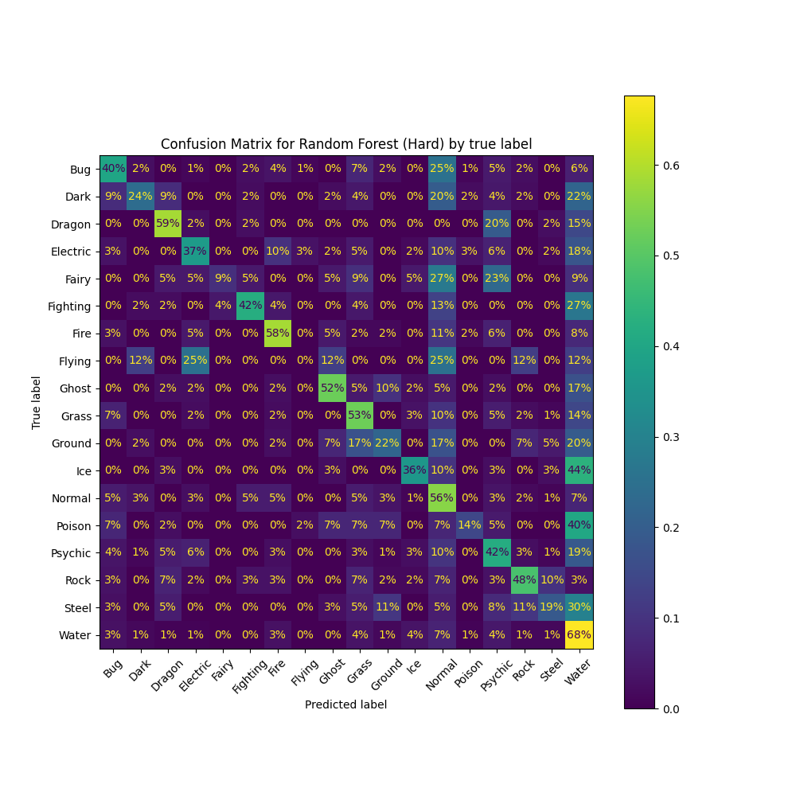
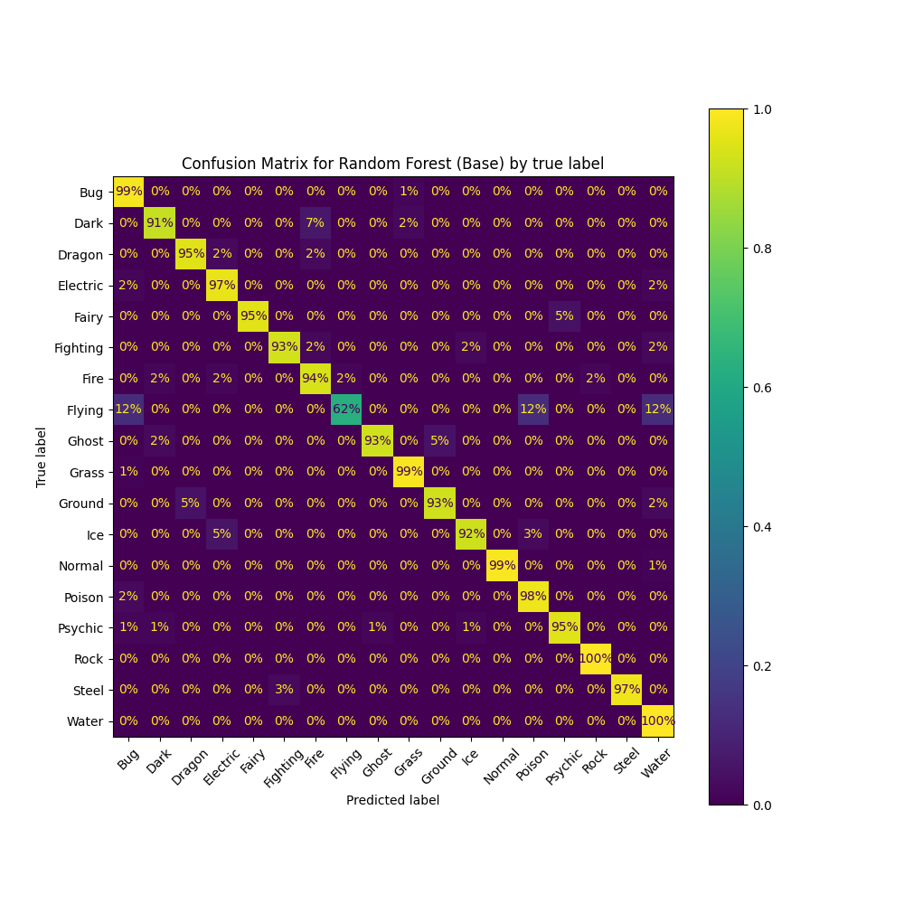
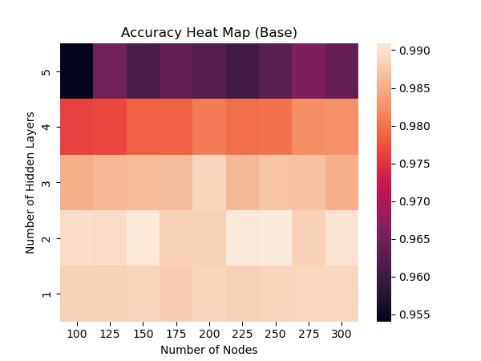
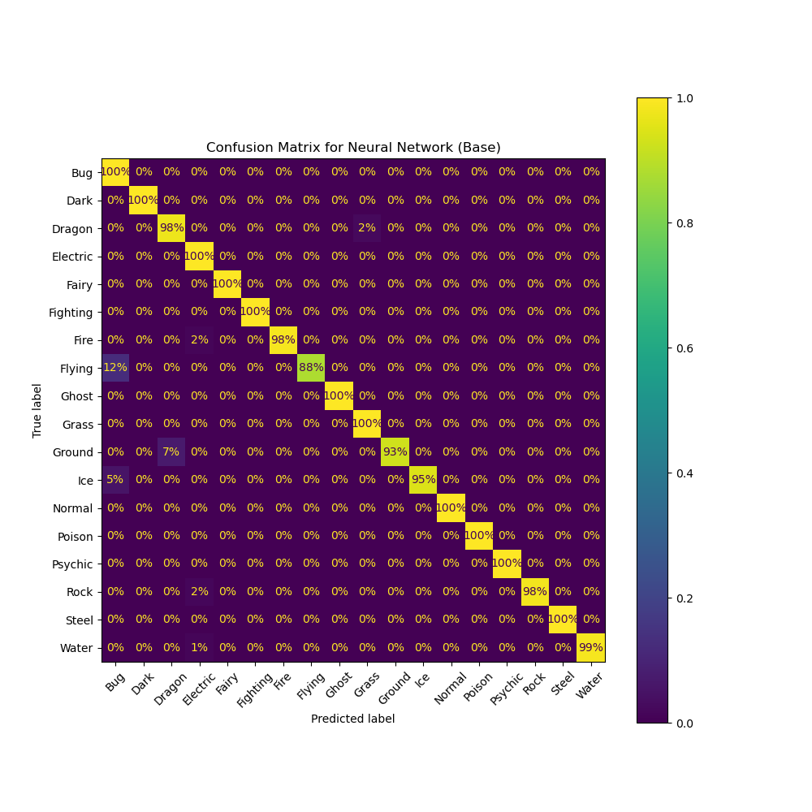
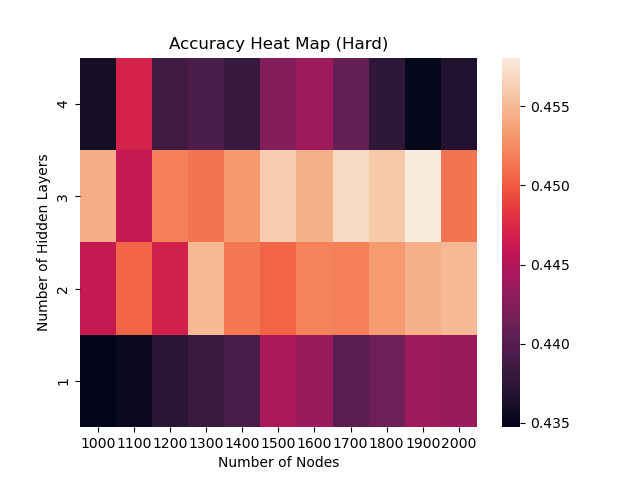
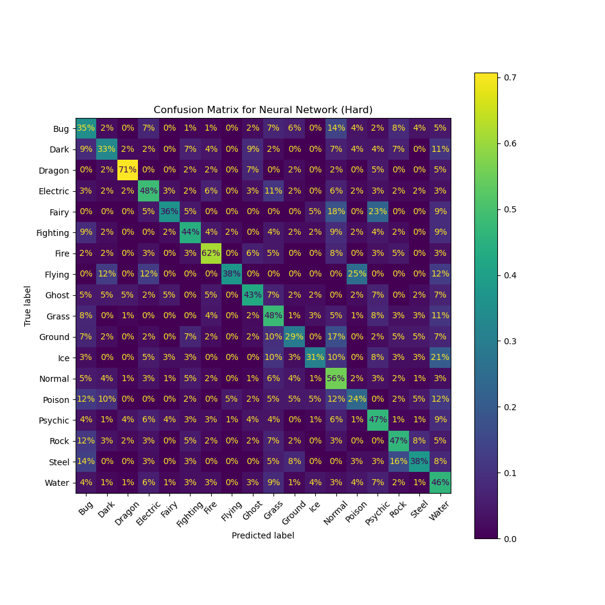

```{r setup, include=FALSE}
knitr::opts_chunk$set(echo = TRUE)
require(tidyverse)
require(float)
require(tinytex)
require(knitr)
require(grid)
require(gridExtra)
require(ggplot2)
require(png)
df <- read.csv("../data/scraped.csv")
```

# Summary

Predicting a Pokémon's type is an inherently difficult task, with 18 possible categories and no clear pattern. Therefore, there is great appeal in applying new methods in an attempt to achieve great accuracy. In this report, we apply classification methods such as logistic regression, support vector machines (SVMs), random forests, and neural networks to an enhanced version of the Pokémon Database dataset. For each model, we perform hyperparameter tuning using Bayesian Optimization and evaluate the tuning process using stratified nested cross-validation. We find that the enhanced features allow all models to achieve near-perfect accuracy. Thus, we turn our attention to a subset of the features to better compare the models. Further, to deal with sparse type categories, we investigate a "duplication" method for multi-label prediction, where a single-label classifier is trained on two copies of each Pokémon corresponding to each of the Pokémon's types. **TODO: conclusion**

# Introduction

Pokémon is one of the most popular games worldwide. In it, players catch, train, and battle using monsters known as Pokémon. In particular, each Pokémon has one or two types such as the elemental type "Water" or the abstract type "Fighting". Each type has advantages and disadvantages against others in battle. As a result, Pokémon players share great interest in using effective types to win battles. Many have attempted to predict a Pokémon's type using other attributes. We would like to compare the methods they used in a standard setting, however their datasets contain different observations and features. Here, we use an improved data set with a more diverse feature space. Using a standard nested cross-validation method, we compare the performance between different models.

# Dataset

## Data Scraping

Using the [Pokédex Dataset](https://www.kaggle.com/datasets/mariotormo/complete-pokemon-dataset-updated-090420?select=pokedex_%28Update_04.21%29.csv) as an inspiration, we created our own scrapers with Python libraries `requests`, `beautifulsoup`, and `imageio` to scrape data from the website [Pokémon DB](https://pokemondb.net/pokedex/all). We chose numerical features, or categorical features with a small number of different values. The scraped attributes include biometrics, combat statistics, and training characteristics as well as the `weaknesses` (damage multipliers against other types) of each Pokémon. To augment this data, we scraped images of each Pokémon and computed simple characteristics of the image to serve as additional attributes. A detailed discussion on data processing can be found in Appendix.

### Categorical and Binary Features

| Feature    | Description                                                          |
|:--------------|:--------------------------------------------------------|
| status     | Whether the Pokémon is normal, legendary, sub-legendary, or mythical |
| type_1     | The primary type of the Pokémon                                      |
| type_2     | The secondary type of the Pokémon if it exists                       |
| has_gender | Whether the Pokémon has a gender                                     |

The types include: Bug, Dark, Dragon, Electric, Fairy, Fighting, Fire, Flying, Ghost, Grass, Ground, Ice, Normal, Poison, Psychic, Rock, Steel, Water. See Appendix for [Pokemon Type Frequency](#pokemon-type-frequency)

### Numerical Features

| Feature               | Description                                                        |
|:------------------|:----------------------------------------------------|
| generation            | The chronological divisions of Pokémon, from 1st generation to 8th |
| type_number           | The number of types the Pokémon belong to, either 1 or 2           |
| height_m              | The height of the Pokémon in meters                                |
| weight_kg             | The weight of the Pokémon in kilograms                             |
| abilities_number      | The number of abilities possessed by the Pokémon                   |
| total_points          | Total number of base points                                        |
| hp                    | The base health points (hp) of the Pokémon                         |
| attack                | The base attack of the Pokémon                                     |
| defense               | The base defense of the Pokémon                                    |
| sp_attack             | The base special attack of the Pokémon                             |
| sp_defense            | The base special defense of the Pokémon                            |
| speed                 | The base speed of the Pokémon                                      |
| catch_rate            | Catch rate of the Pokémon                                          |
| base_friendship       | The base friendship of the Pokémon                                 |
| base_experience       | The base experience of a wild Pokémon when caught                  |
| maximum_experience    | The experience needed for the Pokémon to reach the maximum level   |
| egg_type_number       | The number of egg groups the Pokémon egg belongs to                |
| proportion_male       | The proportion of Pokémon that is male, 50% if genderless          |
| egg_cycles            | The number of cycles required to hatch an egg of the Pokémon       |
| damage_from\_**Type** | The damage multiplier when damaged by the move from a **Type**     |

### Image Features (all numerical)

| Feature              | Description                                                                     |
|:----------------|:-----------------------------------------------------|
| size                 | The proportion of pixels occupied by the Pokémon's sprite                       |
| perimeter            | The number of pixels occupied by the sprite's boundary                          |
| perimeter_size_ratio | The ratio of the sprite's perimeter to its actual size                          |
| **Value**\_mean      | The mean of the **Value** pixel value over the entire sprite                    |
| **Value**\_sd        | The standard deviation of the **Value** pixel over the entire sprite            |
| vertical overflow    | The amount by which the sprite touches the boundaries of the image vertically   |
| horizontal overflow  | The amount by which the sprite touches the boundaries of the image horizontally |

**Value** = **Red**, **Green**, **Blue**, **Brightness**

```{r, echo=FALSE, fig.align = 'center', fig.cap='Pikachu. generation: 1, status: Normal, type\\_number: 1, type\\_1: Electric, type\\_2: None, height\\_m: 0.4, speed: 90, catch\\_rate: 190, damage\\_from\\_water: 1, damage\\_from\\_ground: 2, sprite\\_red\\_sd: 0.414'}

```

# Previous Explorations

```{r child = 'tables/previous_works.md'}
```

-   [@pokemondecisiontree]: Simple analysis of the pokemon dataset from generations 1-8. Trying to predict `type_1` using pokemon stats, generation number, as well as mythical/legendary status.
-   [@predictingpokemontypes]: Trying to predict pokemon `type_1` using naive bayes, random forest, and SVMs. Since flying type is severely underrepresented, they remove it and predict only 17 types. Uses pokemon stats, generation number, and legendary status. Additionally used grid search for hyper-parameter tuning, cross-validation, and leave one out cross-validation.
-   [@whosthatnn]: Trying to predict dual pokemon types (`type_1` and `type_2`) using in game sprites from generation 1-5. Utilizes CNN for classification.
-   [@predictingdualtypes]: Trying to predict dual pokemon types (`type_1` and `type_2`) using KNN. For pokemon with only one type, they imputed `type_2` as a repeat of `type_1`, however only predicted for one observation.
-   [@multilabclasstf]: Trying to do multi-label classification with NN in TensorFlow using the in game sprite images.
-   [@pokemontypepredstats]: Multi-label classification using MultiLabelBinarizer, basically one-hot encoding the 18 types and thus allowing it to predict more than one class. Another approach used is classifier chaining and label powersets. The data used only includes the stats of each Pokémon.
-   [@whatsthatpokemon]: Multi-label classification of both types using CNN and fully-connected network (SNN) with pokemon in game sprite images.
-   [@typeusingpokedexentries]: Multi-label classification of both types using natural language processing (NLP) on the pokemon's pokedex descriptions.

# Methods and Results

## Nested Cross-Validation

Acknowledging that the average `type_1` category has fewer than 60 Pokémon, we are working with a small amount of data. To make the most of this, we use 5-fold nested cross validation (CV) so that every observation can take part in both the fitting and evaluation of models. The folds are stratified by `type_1` to ensure a similar type distribution in all folds. For each train-test split, we perform hyperparameter tuning on the training set and use the tuned model to make predictions on the remaining fold. Through this process, we obtain one predicted type for each Pokémon. Comparing the predicted types to the actual types, we get an overall accuracy score for the model and plot a confusion matrix.

## Hyperparameter Tuning

For each train-test split of the outer CV, we perform another inner stratified 5-fold CV to select the best hyperparameters for the given model. However, for most models, the hyperparameter space is continuous and makes exhaustive search impossible. For example, regularized logistic regression admits a two-dimensional parameter space: $(0,{\infty})\times (0,{\infty})$.

In early attempts, we tried grid search where we discretize the continuous search space and perform exhaustive search over the combination of hyperparameters in the search space. We then extracted the hyperparameters that optimize the model in a stratified 5-fold CV and treat it as the optimal hyperparameters. For instance, we can reduce the search space of regularized logistic regression into $\{10^{-4}, 10^{-2}, 1, 10^2, 10^4\} \times \{10^{-4}, 10^{-2}, 1, 10^2, 10^4\}$ which contains $5^2 = 25$ points. However, there are two major drawbacks to this method. First, the hyperparameters in the discretized search space may be far from the true optimal parameters. Second, the number of models needed to be fit increases exponentially with the number of dimensions in the search space. This forces one to reduce the density of values in each dimension in order to keep the tuning process manageable.

To address the issue, we use Bayesian optimization (BayesOpt).[@snoek2012practical] Instead of a fixed set of values, we sample one point at a time from the parameter space, and evaluate the corresponding model's cross validation accuracy. We then treat the samples as data and fit a Gaussian process regression model to estimate the cross validation accuracy as a probabilistic function of the parameter space. In doing so, BayesOpt chooses the next sample according to a balance of exploration and exploitation. For exploration, BayesOpt targets points in regions with high uncertainty to gather information. For exploitation, BayesOpt targets points in regions with high expected accuracy to make incremental improvements. After some number of samples (50 in our case), BayesOpt reports the sample with the highest accuracy as the optimum. While it is not necessarily deterministic, it solves the problems faced by grid search. Namely, the optimum is not restricted to a predetermined set of points, and the algorithm adapts to any number of dimensions without forced exponential blowup.

To implement BayesOpt, we used `scikit-optimize`, which is only capable of tuning `scikit-learn` models. The neural network model is not implemented with `scikit-learn`, so it was tuned using random search. It is similar to BayesOpt in that it is nondeterministic, but random search chooses its samples entirely at random.

## Duplication

Pokemon type prediction can be treated as either a single-label classification task (`type_1`), or a multi-label classification task (`type_1` and `type_2`).
In the multi-label case, a Pokemon's type can be treated as a multiset of cardinality 2.
Pure Pokemon have a single type with multiplicity 2, while most Pokemon have two different types with multiplicity 1.

To easily develop models for both tasks, we propose duplication, a technique to convert any single-label classifier that outputs class probabilities, into a fixed-cardinality label multiset classifier.
Given a dataset $\mathcal{D} = \{ (x_i, \{ y_{i1}, y_{i2} \} ) \}_{i=1}^N$, we generate a new dataset $\mathcal{D}^\prime = \{ (x_i,y_{i1}), (x,y_{i2}) \}_{i=1}^N$ containing twice as many observations.
We tune a single-label classifier on the $\mathcal{D}^\prime$.
We then take this classifier and scale its predicted type probabilities by 2.
The scaled probabilities represent the expected multiplicity of each label in $y_i$.
Finally, to predict, we apply the following algorithm:

1. $y_1 = \mathrm{argmax}_{y} p_y$ (predict $y_1$ as the type with highest probability)
2. $p_{y_1} \leftarrow p_{y_1} - 1$ (subtract 1 from the probability of $y_1$)
3. $y_2 = \mathrm{argmax}_{y} p_y$ (predict $y_2$ as the next type that maximizes the probability)

For example, a Pokemon with the predicted probabilities (Water: 75%, Grass: 20%, Flying: 5%, rest: 0%) would be scaled to (Water: 1.5, Grass: 0.4, Flying: 0.1, rest: 0.0). Then, Water would be the first predicted class, after which the probability vector would be updated to (Water: 0.5, Grass: 0.4, Flying: 0.1, rest: 0.0). Since Water is still the highest class, it is predicted again (multiplicity 2).

To demonstrate the method, we implemented duplication on all models that use `sklearn`: logistic regression, SVM, and random forest.
We compare the models' performance at the duplication task alongside the normal prediction of `type_1` only.

## Logistic Regression

We focused on multinomial logistic regression using `scikit-learn` package in Python. For multinomial logistic regression with $K \ge 2$ classes, we fit a single classifier with K outputs (one of them is 1), and take the softmax thereof. For regularization, ElasticNet encompasses both L1 and L2 penalties (and with a weak enough regularization term, no-penalty as well). We thus parameterize the search space of potential hyperparameters by the ratio of the L1 and L2 penalties, and the coefficient `C` representing the inverse of regularization strength. Specifically, we utilize Bayesian Optimization to sample over the entire continuous space with ranges of the ratio of the L1 and L2 penalties and `C` being $[0.0, 1.0]\times [10^{-4}, 10^{4}]$.

After applying Bayesian Optimization and nested cross-validation with $k = 5$ folds, we observe that the ratio of the L1 and L2 penalties is constant at $1.0$ which indicates that the L1 penalty (LASSO regularization) is chosen each time. The coefficient `C` fluctuates between the ranges of $[0, 5]$. Overall, we obtain a model accuracy of $99.147\%$. The high accuracy suggests that the data is linearly separable.

We also examined the model performance without the features `type_2` and the `damage_from_{Type}` and used the same search space. We observe that the ratio of the L1 and L2 penalties fluctuates in the range $[0.4, 1]$ and the coefficient `C` fluctuates between $[3.5, 10]$, indicating weaker regularization. The model performance decreased significantly where the overall prediction accuracy decreased to $36.903\%$. As a result, it would suggest that the `type_2` and `damage_from_{Type}` variables are very significant features in predicting Pokémon type.

We observe similar trends at the duplication task.
That is, the majority of models choose to use solely the L1 penalty (LASSO regularization).
When excluding `type_2` and `damage_from_{Type}`, the level of regularization also decreases.

## Support Vector Machines

We trained support vector machine (SVM) models using the `scikit-learn` package in Python. The hyperparameters we tested are the regularization parameter `C`, the `kernel` type, the `degree` of the polynomial if the kernel is polynomial, the kernel coefficient `gamma`, an independent term in the kernel function `coef0` (only significant for a polynomial/sigmoid kernel), and whether to use probability output. For tuning, we consider the linear, polynomial, and radial basis function (RBF) kernels. The sigmoid kernel is never guaranteed to be positive semi-definite and is therefore avoided.[@kernels] Moreover, the linear kernel is just a special case of the polynomial kernel (with `degree` = 1, `gamma` = 1, `coef0` = 0), allowing us to specify it together with the polynomial kernel. Thus the hyperparameter search space is presented as `degree`, `C`, `gamma`, and `coef0` ranging between $[2, 5]\times[10^{-4}, 10^{4}]\times[10^{-3}, 10^{3}]\times[0.0, 1.0]$ for the polynomial kernel. For the RBF kernel, the search space is `C` and `gamma` ranging between $[10^{-4}, 10^{4}] \times [10^{-3}, 10^{3}]$ respectively.

There are two formulations of multiclass classification using SVMs: one-versus-rest (OVR) and one-versus-one (OVO). We decide to use OVR because it fits one SVM for each of the 18 classes, whereas OVO will create $18 \times 17 = 306$ models which would increase the model complexity, training time, and the risk of overfitting.

After hyperparameter tuning, we observe that in general, the best kernel was the RBF with the regularization parameter `C` fluctuating from $33$ to $10,000$ where `C` is inversely proportional to the strength of regularization and `gamma` was between $[0.002, 0.036]$. Overall, we obtain a model accuracy of $96.680\%$.

Next, we investigate the strength of the model without the features `type_2` and the `damage_from_{Type}` without changing the search space. We observed that in general the best kernel was still the radial basis function, with `C` and `gamma` ranging from $[18, 867]\times[0.15, 0.27]$ respectively. After removing these features, the overall model accuracy falls to $46.583\%$.

When investigating duplication, we find that the model tuning code does not terminate.
The reason for this is [discussed in sklearn itself](https://github.com/scikit-learn/scikit-learn/issues/12738).
When two points have exactly the same predictor values, their corresponding rows in the kernel matrix are identical.
This makes the matrix singular, preventing optimization.
Thus, we are unable to evaluate the duplication task for SVMs.

## Random Forests

For random forests, we utilized the `scikit-learn` package in Python. The search space of hyperparameters we tested include

-   `criterion`: The splitting criterion at each node, either Gini index or logistic loss (equivalent to entropy).
-   `max_features`: The number of random features to try at each split. Ranges from 1 to the number of features in the dataset.
-   `max_depth`: the maximum depth of the tree. Ranges from 1 to the number of observations, but in practice we do not need even close to that much. We generously limit this to the number of features, to make the optimization problem easier.

After hyperparameter tuning, we observe that in general the Gini index criterion was preferred. The optimal `max_depth`s range between 10 and 38. The optimal `max_features` range between 35 and 74. Overall, we obtain a model accuracy of $96.491\%$.

Next we also investigate the strength of the model without the features `type_2` and the `damage_from_{Type}`, with the same search space as before. We observe that the `gini` index criterion was still preferred while the `max_depth` and `max_features` fluctuate between $[13, 37]\times[3, 37]$ respectively. Overall, we obtain a model accuracy of $44.971\%$ after removing these features.

## Neural Network

We used PyTorch to implement neural networks. Our network is a multilayer perceptron with `H-layer` hidden layers and `node` number of nodes per hidden layer. The model is trained for `epoch` epochs using batch stochastic gradient descent with an Adam optimizer. `epoch` acts as a regularization parameter; by stopping the training process early it can prevent overfitting.

We using `H_layer` = 2, `node` = 250, and `epoch` = 350 as a rough estimate of the optimal values, selected using a broad grid search. See Appendix [Initial Hyperparameter Values for Neural Networks](#initial-hyperparameter-values-for-neural-networks)
. Then, we select hyperparameters using random search (20 steps) of nearby values. The nested CV result shows an average of $98.957\%$ accuracy with lowest fold having $98.881\%$ accuracy and highest fold having $99.318\%$ accuracy.

After removing `type_2` and `damage_from_{Type}`, we find that the prediction task becomes much more difficult, thus we need more expressive models to converge within a reasonable number of epochs. In this case, the broad grid search selects `H_layer` = 2, `node` = 1300, and `epoch` = 200 as initial values for random search. The nested CV result shows an average of $45.160\%$ accuracy with lowest fold having $43.454\%$ and highest fold having $45.940\%$ accuracy.

# Analysis and Model Comparision

## Confusion Matrices Intepretation

Overall, every classifier performed extremely well (over 90% accuracy) when `type_2` and `damage_from_{Type}` were included in the feature space. The result is not surprising as `damage_from_{Type}` is strongly related to the type of the Pokemon and `type_2` eliminates a choice of `type_1` (`type_2` and `type_1` must be different). Thus, the performance of the models are expected. See Appendix for Confusion Matrices [Confusion Matrix for Logistic Regression (Base)](#confusion-matrix-for-logistic-regression-base)
, [Confusion Matrix for Support Vector Machine (Base)](#confusion-matrix-for-support-vector-machine-base)
, [Confusion Matrix for Random Forest (Base)](#confusion-matrix-for-random-forest-base)
, [Confusion Matrix for Neural Network (Base)](#confusion-matrix-for-neural-network-base)

However, the same does not hold when we train the model Without the `type_2` and `damage_from_{Type}` variables. The result from nested CV suggests a drastic decrease in prediction accuracy for all models.

```{r, out.width="60%", out.height="60%", echo = F, fig.align='center', fig.cap="Confusion Matrix on Test Data for Random Forest (SVM) Without type\\_2 and damage\\_from\\_\\{type\\} Features"}

```

For instance, in the Confusion Matrix for Random Forest (Hard), we observed that the model was not able to predict any `Flying` type correctly and did extremely poorly for `Fairy` type. This is likely due to the small sample size of `Flying` and `Fairy` type Pokemon which has 8 and 19 samples respectively. Another interesting observation is that all models tend to make errors by falsely classifying the Pokemon as `Water` or `Bug` type. This is most obvious in random forest where most errors occurred in the `Water` column and might have to do with the relatively large `Water` type Pokemon population (136 `Water` type) and their generic attributes compared to the population. In contrast, `Dragon` and `Fire` type Pokémon has a relatively higher prediction accuracy across more models. We are certain that the high `Dragon` type prediction accuracy is because some of their particularly noticeable features: an extremely high `egg_cycles` and an extremely low `catch_rate` See Appendix [Dragon Pokémon Features](#dragon-pokemon-features)
. As for the `Fire` type Pokémon, we did not find a particular feature that stands out could not explaining its high prediction accuracy. See Appendix for Confusion Matrices [Confusion Matrix for Logistic Regression (Hard)](#confusion-matrix-for-logistic-regression-hard), [Confusion Matrix for Support Vector Machine (Hard)](#confusion-matrix-for-support-vector-machine-hard), [Confusion Matrix for Neural Network (Hard)](#confusion-matrix-for-neural-network-hard)


## Model Comparison

| Model                             | Performance |
|-----------------------------------|-------------|
| Logistic Regression (base)        | 99.147%     |
| Logistic Regression (hard)        | 36.903%     |
| Logistic Regression (dup/base)    | 97.817%     |
| Logistic Regression (dup/hard)    | 35.626%     |
| Support Vector Machine (base)     | 96.680%     |
| Support Vector Machine (hard)     | 46.583%     |
| Support Vector Machine (dup/base) | NA          |
| Support Vector Machine (dup/hard) | NA          |
| Random Forest (base)              | 96.491%     |
| Random Forest (hard)              | 44.971%     |
| Random Forest (dup/base)          | 99.763%     |
| Random Forest (dup/hard)          | 39.945%     |
| Neural Network (base)             | 99.318%     |
| Neural Network (hard)             | 45.160%     |
| Neural Network (dup/base)         | NA          |
| Neural Network (dup/hard)         | NA          |

-   base: with all features in the dataset
-   hard: without type_2 and damage_from_{Type} features
-   dup: with duplication method applied

From the table, it is evident that using the base features the models returned by each method performs extremely well (over 95% accuracy).
Comparing `base` versus `dup/base`, logistic regression performs slightly worse with duplication applied, while random forests perform slightly better.
However, the difference is only a few percent, which is not large compared to the fluctuations we experience in cross-validation accuracy.

Whereas, once hard mode was applied, the accuracy dropped significantly regardless if the duplication method was applied or not, indicating that type_2 and damage_from_{Type} features add valuable information in predicting the Pokémon's type.

We achieve the highest overall accuracy with random forest with the duplication method applied on all the features, and the lowest overall accuracy with logistic regression with the duplication method applied on hard mode.

\newpage

# References {#sec:ref}

<div id="refs"></div>

\newpage

# Appendix

## Initial Hyperparameter Values for Neural Networks

Since neural networks are more expensive to train than the other models explored here, we first conduct a broad grid search to find approximate optimal values of the tuning parameters `H-layer`, `node`, and `epoch`. Instead of BayesOpt, we do a broad grid search with cross-validation for `H-layer` (between 1 and 5) and `node` (between 100 and 300), fixing `epoch` = 400 to a reasonable value. Then, we perform another broad grid search over `epoch` (between 300 and 550) using the optimal `H-layer` and `node`. Due to the variability of batch stochastic gradient descent, we repeat the training process 5 times for each CV fold to reduce variance. With the "optimized" hyperparameters, we conduct a nested CV to evaluate the algorithm performance where we randomly generate hyperparameters that is close to "optimized" hyperparameters in each inner CV in search of a potentially better model. (Note we will include the "optimized" hyperparameters in nested CV).

After removing `type_2` and `damage_from_{Type}`, we find that the prediction task becomes much more difficult, thus we need more expressive models to converge within a reasonable number of epochs. This time, the first broad grid search is over `H-layer` (between 1 and 4) and `node` (between 1000 and 2000), fixing `epoch` = 600. After examining the training curves of the models from the first grid search, we choose the second grid search over `epoch` to be between 100 and 300.

\newpage

## Pokemon Type Frequency

```{r, warning=FALSE, echo=FALSE, fig.dim = c(11,4.6), fig.align="center", out.width="100%", out.height="50%",fig.cap = "Pokemon Type Frequency for Type 1 and Type 2"}
p1 <- ggplot(df, aes(x = type_1)) +
  geom_histogram(stat = "count", fill = "dodgerblue", color = "black") +
  labs(x = "type_1", y = "Frequency", title = "Histogram of type_1") +
  theme(axis.text.x = element_text(angle = 45, hjust = 1))+
  theme(plot.title=element_text(hjust=0.5))
p2 <- ggplot(subset(df, type_2 != "None"), aes(x = type_2)) +
  geom_histogram(stat = "count", fill = "dodgerblue", color = "black") +
  labs(x = "type_2", y = "Frequency", title = "Histogram of type_2") +
  theme(axis.text.x = element_text(angle = 45, hjust = 1))+
  theme(plot.title=element_text(hjust=0.5))
grid.arrange(p1,p2,ncol = 2)
```
\newpage

## Dragon Pokemon Features

```{r, out.width="80%", out.height="80%", echo = F, fig.align='center',fig.cap="The noticable feature of Dragon type Pokemon (purple in colour)"}
knitr::include_graphics("images/dragon.png")
```

\newpage

## Confusion Matrix for Logistic Regression (Base)

```{r, out.width="100%", out.height="100%", echo = F, fig.align='center',fig.cap="Confusion Matrix on Test Data for Logistic Regression"}
knitr::include_graphics("../models/logistic_regression_base/confusion_matrix_by_true.png")
```

\newpage

## Confusion Matrix for Logistic Regression (Hard)

```{r, out.width="100%", out.height="100%", echo = F, fig.align='center',fig.cap="Confusion Matrix on Test Data for Logistic Regression Without type\\_2 and damage\\_from\\_\\{type\\} Features"}
knitr::include_graphics("../models/logistic_regression_hard/confusion_matrix_by_true.png")
```

\newpage

## Confusion Matrix for Support Vector Machine (Base)

```{r, out.width="100%", out.height="100%", echo = F, fig.align='center',fig.cap="Confusion Matrix on Test Data for Support Vector Machine (SVM) Without type\\_2 and damage\\_from\\_\\{type\\} Features"}
knitr::include_graphics("../models/support_vector_machine_base/confusion_matrix_by_true.png")
```

\newpage

## Confusion Matrix for Support Vector Machine (Hard)

```{r, out.width="100%", out.height="100%", echo = F, fig.align='center',fig.cap="Confusion Matrix on Test Data for Support Vector Machine (SVM) Without type\\_2 and damage\\_from\\_\\{type\\} Features"}
knitr::include_graphics("../models/support_vector_machine_hard/confusion_matrix_by_true.png")
```

\newpage

## Confusion Matrix for Random Forest (Base)

```{r, out.width="100%", out.height="100%", echo = F, fig.align='center',fig.cap="Confusion Matrix on Test Data for Random Forest (SVM)"}

```

\newpage

## Accuracy Heat map for Neural Network (Base)

```{r, out.width="100%", out.height="100%", echo = F, fig.align='center',fig.cap="The accuracy heat map for Neural Network with different number of hidden layers and nodes per layer. 2 hidden layers with 250 nodes seem to work the best."}

```

\newpage

## Confusion Matrix for Neural Network (Base)

```{r, out.width="100%", out.height="100%", echo = F, fig.align='center',fig.cap="The confusion matrix for Neural Network"}

```

\newpage

## Accuracy Heat map for Neural Network (Hard)

```{r, out.width="100%", out.height="100%", echo = F, fig.align='center',fig.cap="The accuracy heat map for Neural Network with different number of hidden layers and nodes per layer Without type\\_2 and damage\\_from\\_\\{type\\} Features. 3 hidden layers with 1900 nodes seem to work the best"}

```

\newpage

## Confusion Matrix for Neural Network (Hard)

```{r, out.width="100%", out.height="100%", echo = F, fig.align='center',fig.cap="The accuracy heat map for Neural Network without type\\_2 and damage\\_from\\_\\{type\\} Features"}

```

\newpage

# Code

```{r, child=c('converted_ipynb/logistic_regression.md', 'converted_ipynb/support_vector_machine.md', 'converted_ipynb/random_forest.md', 'converted_ipynb/neural_network_base.md', 'converted_ipynb/neural_network_hard.md')}
```

```{r, child=c('converted_py/model/__init__.md', 'converted_py/model/duplication.md', 'converted_py/model/model.md', 'converted_py/model/sk_model.md', 'converted_py/scrape/util/dict.md', 'converted_py/scrape/util/soup.md', 'converted_py/scrape/util/sprite.md', 'converted_py/scrape/__init__.md', 'converted_py/scrape/scrape.md', 'converted_py/scrape/variant.md', 'converted_py/tune/__init__.md', 'converted_py/tune/dimension.md', 'converted_py/tune/outer_cv.md', 'converted_py/tune/sk_bayes.md', 'converted_py/tune/tuner.md', 'converted_py/util/__init__.md', 'converted_py/util/accuracy.md', 'converted_py/util/confusion.md', 'converted_py/util/duplication.md', 'converted_py/util/parallel.md')}
```
